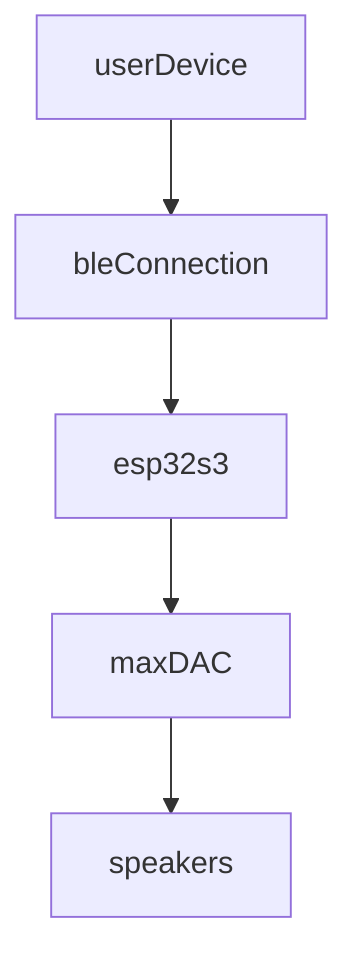

Issues identified:

The ESP32 does not work with the library I have attempted to use from an online guide, lib in [question](https://github.com/pschatzmann/ESP32-A2DP). This is due to A2DP being a part of the bluetooth classic specification which the ESP32-S3 does not support.

[ESP32-audioI2S](https://github.com/schreibfaul1/ESP32-audioI2S) lib is a potential solution

Alternative solution being explored at 10:00 02/05/24 is to:

the communication needs to be able to transmit audio data to the esp32, and the esp32 s3 needs to be able to process it and then output the digital signal to the dac to be played by the speakers
