screen data:
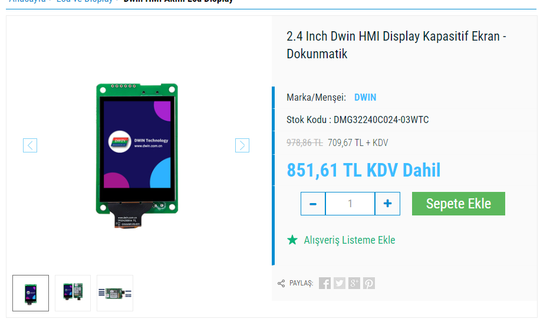
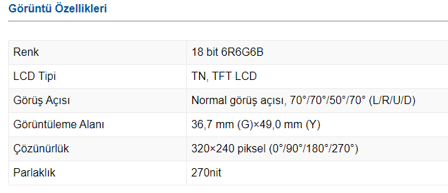

14.25 : 1 scale for model;
|dimension|original (mm)| model value (mm)|
|-----|-----|-----|
|height |2134| |
|width |1186| |
| door width |732| |
| door height |1944| |
| door distance from ground panel || |

| model dimensions                | faces                                                  |
| ------------------------------- | ------------------------------------------------------ |
| front                           | 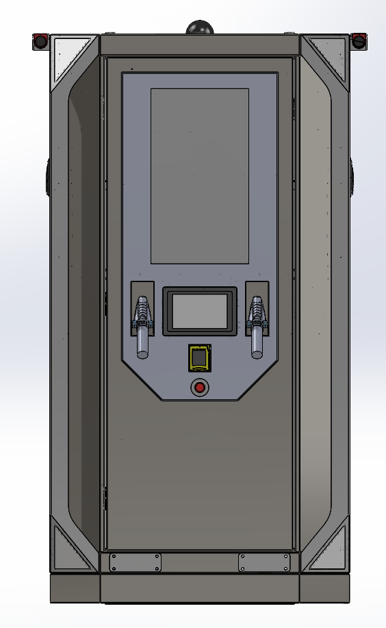{width="300px" height="auto"}  |
| right                           | 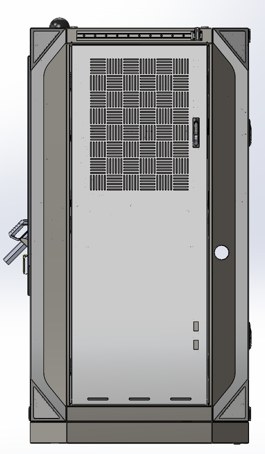{width="300px" height="auto"}  |
| back                            | 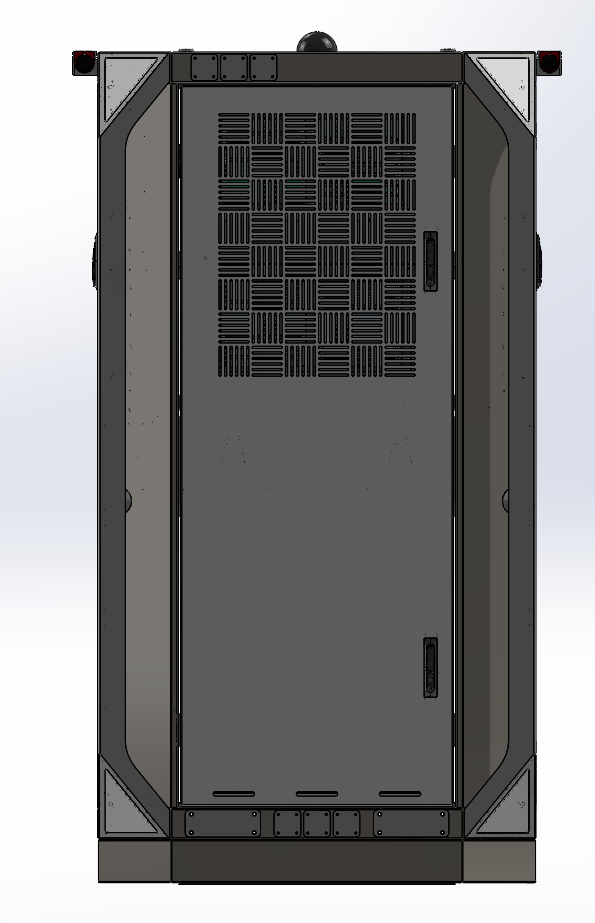{width="300px" height="auto"}  |
| left                            | 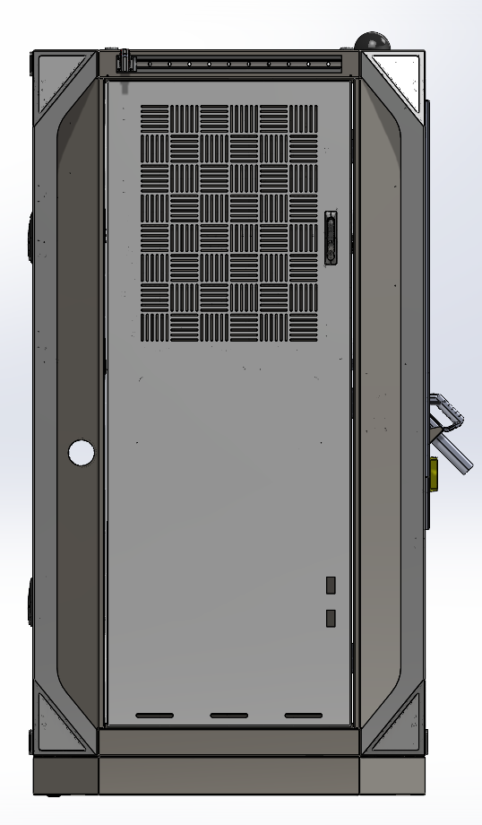{width="300px" height="auto"}  |
| front right diagonal            | 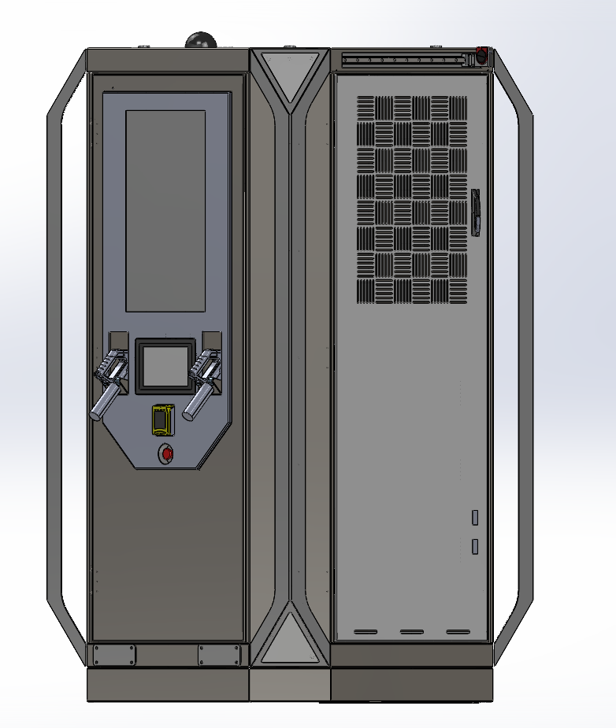{width="300px" height="auto"}  |
| right back diagonal             | 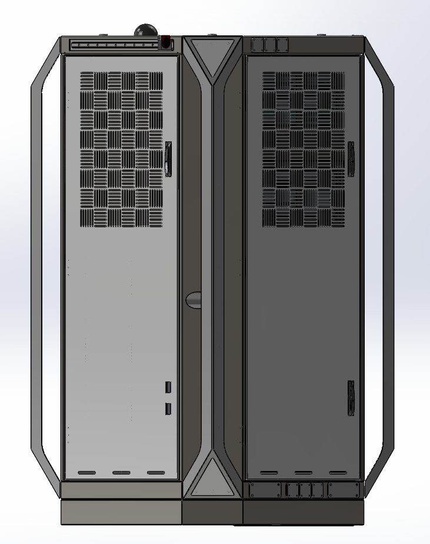{width="300px" height="auto"}  |
| back left diagonal              | 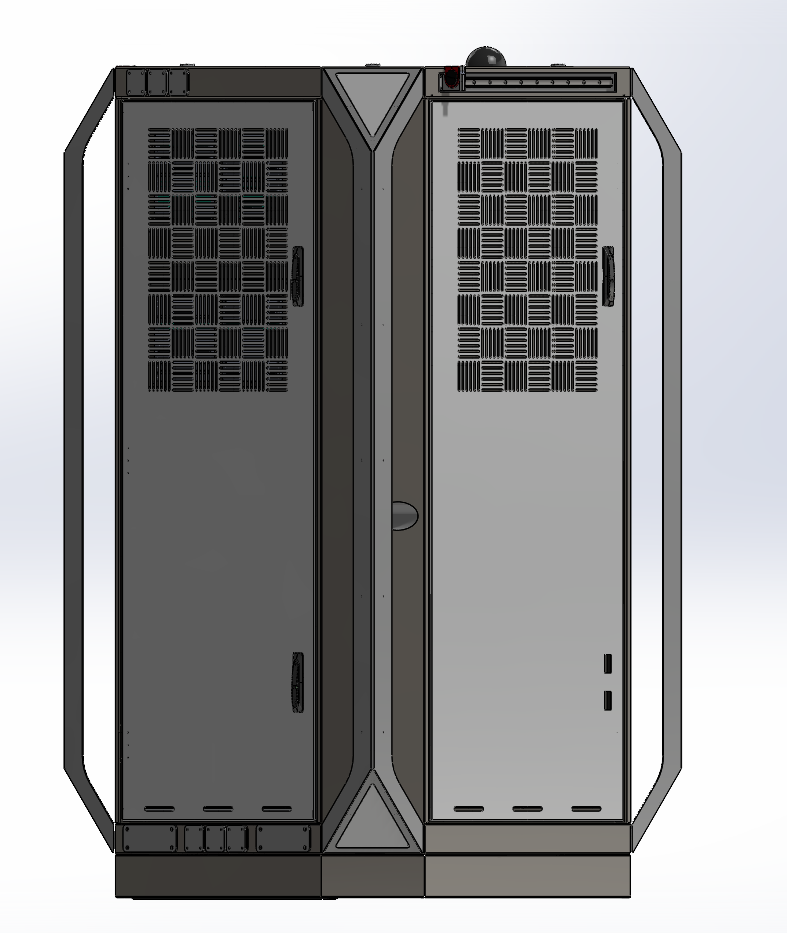{width="300px" height="auto"}  |
| left front diagonal             | 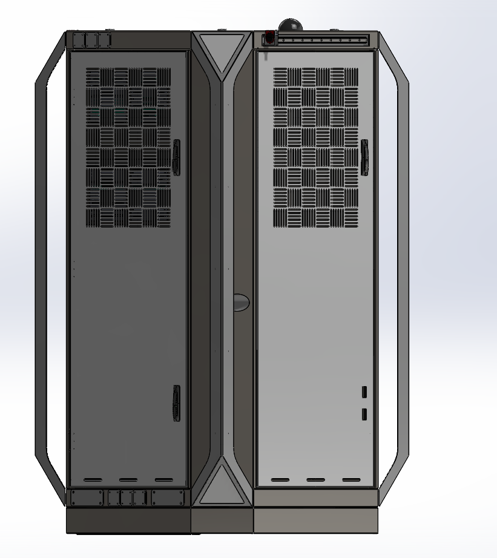{width="300px" height="auto"} |
| top - front                     | 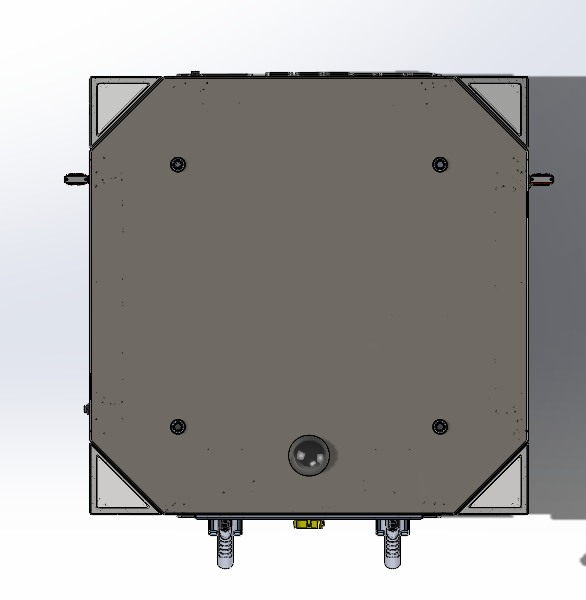{width="300px" height="auto"}  |
| bottom - front                  | 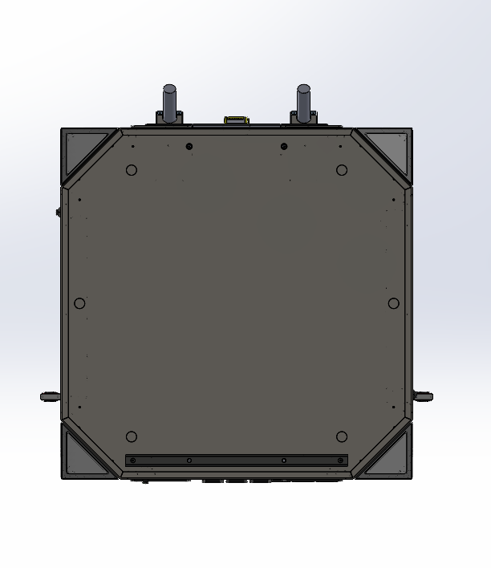{width="300px" height="auto"}  |
| charge plug side view for ratio | 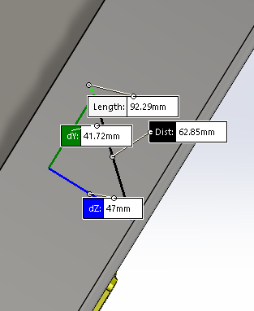{width="300px" height="auto"} |
